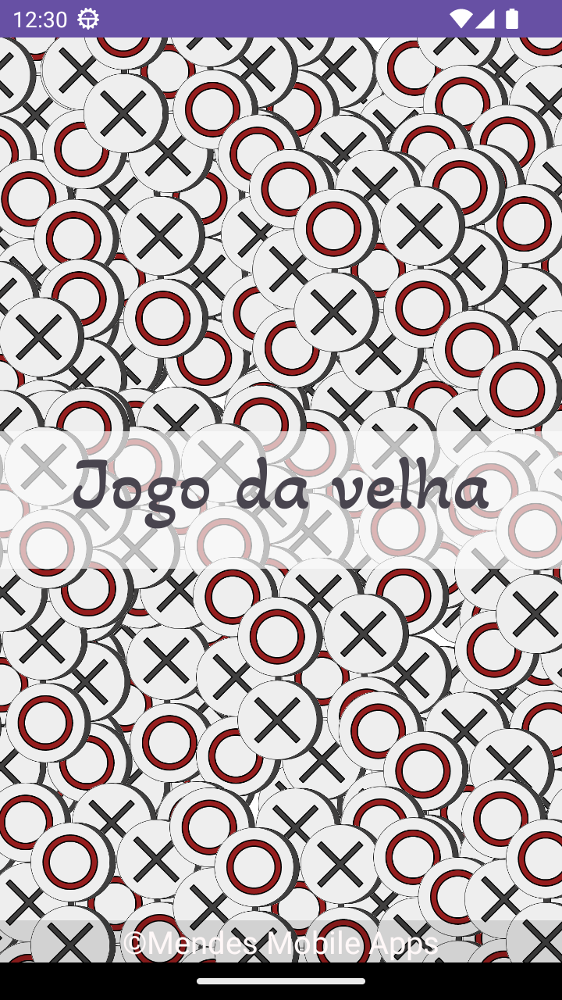
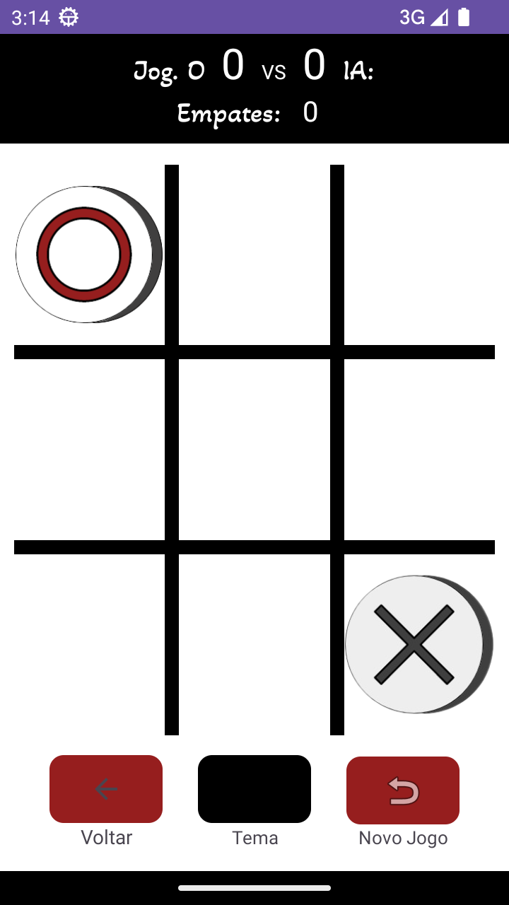
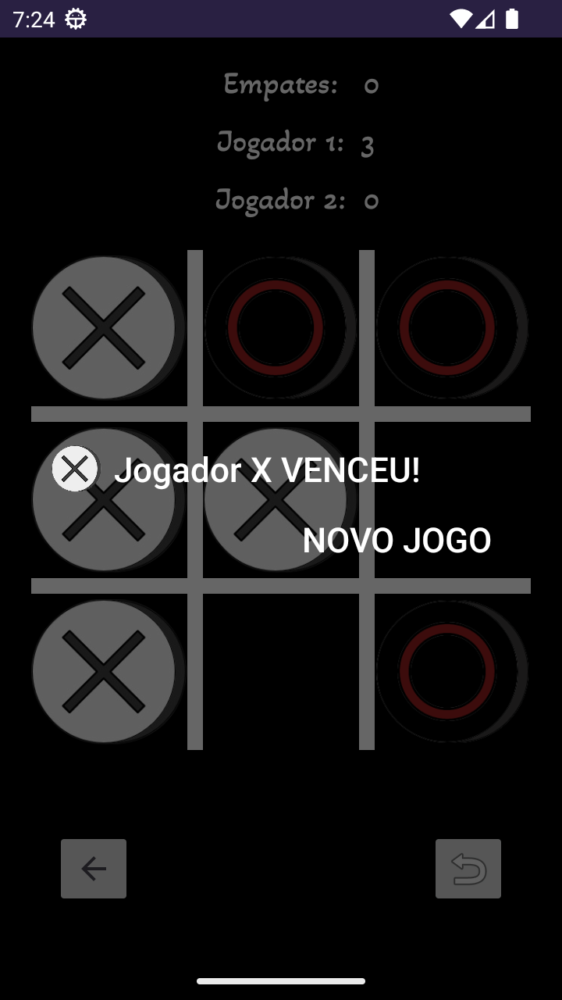

# Jogo da Velha Android


Este é um simples jogo da velha desenvolvido para dispositivos Android, utilizando as linguagens Java e Kotlin. É um projeto open-source que pode ser facilmente baixado, compilado e executado em seu dispositivo Android.

## video
https://drive.google.com/file/d/1n7uaAsBqX9No1Pr_jJo9DAg9tfIWaYHl/view?usp=drive_link

## Características

- Interface de usuário simples e intuitiva.
- Jogabilidade contra um adversário computadorizado.
- Marcadores visuais para acompanhar o progresso do jogo.
- Detecção de vitória, derrota ou empate.
- Reinício do jogo.

## Capturas de tela

<div style="display:flex; flex-direction:row">
  
  
  
</div>


## Como Executar

1. Clone este repositório para o seu computador usando o seguinte comando:

```bash
git clone https://github.com/CristianoMends/Jogo-Da-Velha-Android
````
2. Abra o projeto no Android Studio.

3. Conecte o seu dispositivo Android ao computador ou use um emulador.

4. Execute o aplicativo pressionando o botão "Run" no Android Studio.

## Tecnologias Utilizadas:
<br>Java
<br>Kotlin

## Contato
Se você tiver alguma dúvida ou sugestão, sinta-se à vontade para entrar em contato.

Email:
```bash
mendescristiano012@gmail.com
````
LinkedIn:
```bash
https://www.linkedin.com/in/cristiano-mendes-link/
````
